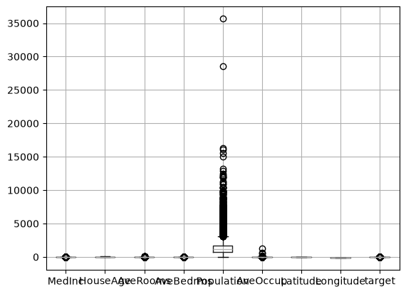
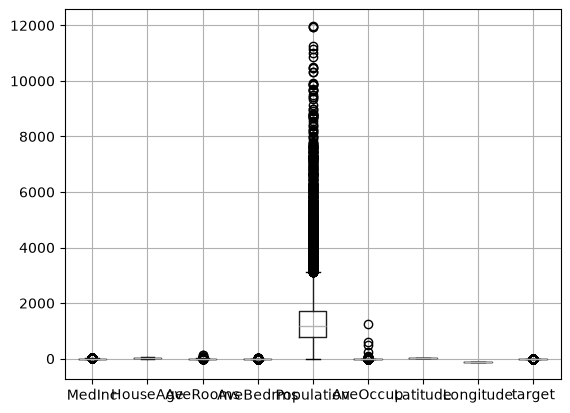
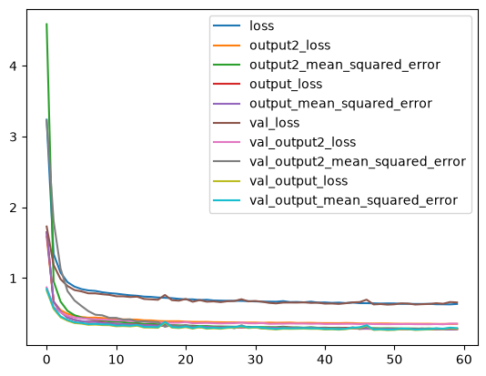
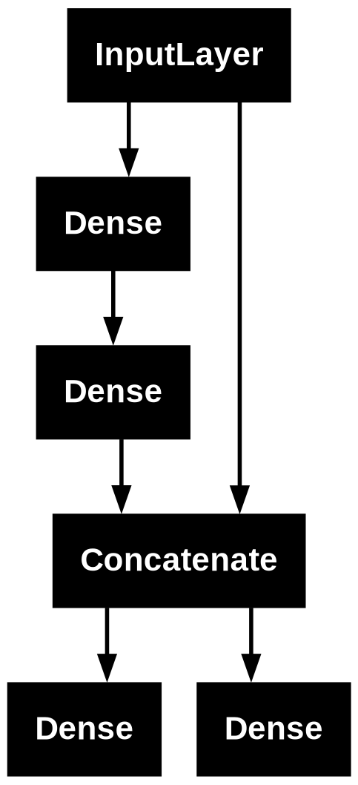

# Wide and Deep Neural Network
### by Pooya Valizadeh

what are Wide and Deep Neural networks???

Wide & Deep Neural Networks are a type of neural network architecture introduced by Google in 2016 that combines two different types of learning into one model:

Wide part → Learns memorization (remembers specific patterns/examples)

Deep part → Learns generalization (understands new, unseen patterns)


```python
import pandas as pd
import pandas as pd
import matplotlib.pyplot as plt
from tensorflow import keras

import warnings
warnings.filterwarnings("ignore")
```


```python
from sklearn.datasets import fetch_california_housing as data
data()
```


    {'data': array([[   8.3252    ,   41.        ,    6.98412698, ...,    2.55555556,
               37.88      , -122.23      ],
            [   8.3014    ,   21.        ,    6.23813708, ...,    2.10984183,
               37.86      , -122.22      ],
            [   7.2574    ,   52.        ,    8.28813559, ...,    2.80225989,
               37.85      , -122.24      ],
            ...,
            [   1.7       ,   17.        ,    5.20554273, ...,    2.3256351 ,
               39.43      , -121.22      ],
            [   1.8672    ,   18.        ,    5.32951289, ...,    2.12320917,
               39.43      , -121.32      ],
            [   2.3886    ,   16.        ,    5.25471698, ...,    2.61698113,
               39.37      , -121.24      ]], shape=(20640, 8)),
     'target': array([4.526, 3.585, 3.521, ..., 0.923, 0.847, 0.894], shape=(20640,)),
     'frame': None,
     'target_names': ['MedHouseVal'],
     'feature_names': ['MedInc',
      'HouseAge',
      'AveRooms',
      'AveBedrms',
      'Population',
      'AveOccup',
      'Latitude',
      'Longitude'],
     'DESCR': '.. _california_housing_dataset:\n\nCalifornia Housing dataset\n--------------------------\n\n**Data Set Characteristics:**\n\n:Number of Instances: 20640\n\n:Number of Attributes: 8 numeric, predictive attributes and the target\n\n:Attribute Information:\n    - MedInc        median income in block group\n    - HouseAge      median house age in block group\n    - AveRooms      average number of rooms per household\n    - AveBedrms     average number of bedrooms per household\n    - Population    block group population\n    - AveOccup      average number of household members\n    - Latitude      block group latitude\n    - Longitude     block group longitude\n\n:Missing Attribute Values: None\n\nThis dataset was obtained from the StatLib:\nhttps://lib.stat.cmu.edu/datasets/houses.zip\n\nThe target variable is the median house value for California districts,\nexpressed in hundreds of thousands of dollars ($100,000).\n\nThis dataset was derived from the 1990 U.S. census, using one row per census\nblock group. A block group is the smallest geographical unit for which the U.S.\nCensus Bureau publishes sample data (a block group typically has a population\nof 600 to 3,000 people).\n\nA household is a group of people residing within a home. Since the average\nnumber of rooms and bedrooms in this dataset are provided per household, these\ncolumns may take surprisingly large values for block groups with few households\nand many empty houses, such as vacation resorts.\n\nIt can be downloaded/loaded using the\n:func:`sklearn.datasets.fetch_california_housing` function.\n\n.. rubric:: References\n\n- Pace, R. Kelley and Ronald Barry, Sparse Spatial Autoregressions,\n  Statistics and Probability Letters, 33:291-297, 1997.\n'}


## preprocessing


```python
df = pd.DataFrame(data().data, columns=data().feature_names)
df['target'] = data().target

print(df.head())
df.boxplot()
plt.show()
```

       MedInc  HouseAge  AveRooms  AveBedrms  Population  AveOccup  Latitude  \
    0  8.3252      41.0  6.984127   1.023810       322.0  2.555556     37.88   
    1  8.3014      21.0  6.238137   0.971880      2401.0  2.109842     37.86   
    2  7.2574      52.0  8.288136   1.073446       496.0  2.802260     37.85   
    3  5.6431      52.0  5.817352   1.073059       558.0  2.547945     37.85   
    4  3.8462      52.0  6.281853   1.081081       565.0  2.181467     37.85   
    
       Longitude  target  
    0    -122.23   4.526  
    1    -122.22   3.585  
    2    -122.24   3.521  
    3    -122.25   3.413  
    4    -122.25   3.422  


    

    


```python

df = df[(df < 12000).all(axis=1)]
df.head()
```


<div>
<style scoped>
    .dataframe tbody tr th:only-of-type {
        vertical-align: middle;
    }

    .dataframe tbody tr th {
        vertical-align: top;
    }

    .dataframe thead th {
        text-align: right;
    }
</style>
<table border="1" class="dataframe">
  <thead>
    <tr style="text-align: right;">
      <th></th>
      <th>MedInc</th>
      <th>HouseAge</th>
      <th>AveRooms</th>
      <th>AveBedrms</th>
      <th>Population</th>
      <th>AveOccup</th>
      <th>Latitude</th>
      <th>Longitude</th>
      <th>target</th>
    </tr>
  </thead>
  <tbody>
    <tr>
      <th>0</th>
      <td>8.3252</td>
      <td>41.0</td>
      <td>6.984127</td>
      <td>1.023810</td>
      <td>322.0</td>
      <td>2.555556</td>
      <td>37.88</td>
      <td>-122.23</td>
      <td>4.526</td>
    </tr>
    <tr>
      <th>1</th>
      <td>8.3014</td>
      <td>21.0</td>
      <td>6.238137</td>
      <td>0.971880</td>
      <td>2401.0</td>
      <td>2.109842</td>
      <td>37.86</td>
      <td>-122.22</td>
      <td>3.585</td>
    </tr>
    <tr>
      <th>2</th>
      <td>7.2574</td>
      <td>52.0</td>
      <td>8.288136</td>
      <td>1.073446</td>
      <td>496.0</td>
      <td>2.802260</td>
      <td>37.85</td>
      <td>-122.24</td>
      <td>3.521</td>
    </tr>
    <tr>
      <th>3</th>
      <td>5.6431</td>
      <td>52.0</td>
      <td>5.817352</td>
      <td>1.073059</td>
      <td>558.0</td>
      <td>2.547945</td>
      <td>37.85</td>
      <td>-122.25</td>
      <td>3.413</td>
    </tr>
    <tr>
      <th>4</th>
      <td>3.8462</td>
      <td>52.0</td>
      <td>6.281853</td>
      <td>1.081081</td>
      <td>565.0</td>
      <td>2.181467</td>
      <td>37.85</td>
      <td>-122.25</td>
      <td>3.422</td>
    </tr>
  </tbody>
</table>
</div>


```python
df.boxplot()
plt.show()
```


    

    


```python
x = df.drop(columns="target").values
y = df["target"].values
```


```python
from sklearn.model_selection import train_test_split as tts 
xtrain , xtest , ytrain , ytest = tts(x,y,random_state=26,test_size=0.2)
```


```python
print(xtrain.shape , ytrain.shape , xtest.shape , ytest.shape)
```

    (16503, 8) (16503,) (4126, 8) (4126,)


```python
from sklearn.preprocessing import StandardScaler
scale = StandardScaler()
xtrain = scale.fit_transform(xtrain)
xtest = scale.transform(xtest)
```

## bulding the model


```python
from tensorflow.keras.layers import concatenate , Input , Dense
```


```python
x.shape
```


    (20629, 8)


```python
input_ = Input(shape = (8,))
h1 = Dense(60,activation="relu")(input_)
h2 = Dense(10,activation="relu")(h1)
h3 = concatenate([input_,h2])
output = Dense(1,name="output")(h3)
output2 = Dense(1,name="output2")(h3)
model = keras.Model(input_,[output,output2])
```


```python
model.summary()
```


<pre style="white-space:pre;overflow-x:auto;line-height:normal;font-family:Menlo,'DejaVu Sans Mono',consolas,'Courier New',monospace"><span style="font-weight: bold">Model: "functional_4"</span>
</pre>


<pre style="white-space:pre;overflow-x:auto;line-height:normal;font-family:Menlo,'DejaVu Sans Mono',consolas,'Courier New',monospace">┏━━━━━━━━━━━━━━━━━━━━━┳━━━━━━━━━━━━━━━━━━━┳━━━━━━━━━━━━┳━━━━━━━━━━━━━━━━━━━┓
┃<span style="font-weight: bold"> Layer (type)        </span>┃<span style="font-weight: bold"> Output Shape      </span>┃<span style="font-weight: bold">    Param # </span>┃<span style="font-weight: bold"> Connected to      </span>┃
┡━━━━━━━━━━━━━━━━━━━━━╇━━━━━━━━━━━━━━━━━━━╇━━━━━━━━━━━━╇━━━━━━━━━━━━━━━━━━━┩
│ input_layer_4       │ (<span style="color: #00d7ff; text-decoration-color: #00d7ff">None</span>, <span style="color: #00af00; text-decoration-color: #00af00">8</span>)         │          <span style="color: #00af00; text-decoration-color: #00af00">0</span> │ -                 │
│ (<span style="color: #0087ff; text-decoration-color: #0087ff">InputLayer</span>)        │                   │            │                   │
├─────────────────────┼───────────────────┼────────────┼───────────────────┤
│ dense_8 (<span style="color: #0087ff; text-decoration-color: #0087ff">Dense</span>)     │ (<span style="color: #00d7ff; text-decoration-color: #00d7ff">None</span>, <span style="color: #00af00; text-decoration-color: #00af00">60</span>)        │        <span style="color: #00af00; text-decoration-color: #00af00">540</span> │ input_layer_4[<span style="color: #00af00; text-decoration-color: #00af00">0</span>]… │
├─────────────────────┼───────────────────┼────────────┼───────────────────┤
│ dense_9 (<span style="color: #0087ff; text-decoration-color: #0087ff">Dense</span>)     │ (<span style="color: #00d7ff; text-decoration-color: #00d7ff">None</span>, <span style="color: #00af00; text-decoration-color: #00af00">10</span>)        │        <span style="color: #00af00; text-decoration-color: #00af00">610</span> │ dense_8[<span style="color: #00af00; text-decoration-color: #00af00">0</span>][<span style="color: #00af00; text-decoration-color: #00af00">0</span>]     │
├─────────────────────┼───────────────────┼────────────┼───────────────────┤
│ concatenate_4       │ (<span style="color: #00d7ff; text-decoration-color: #00d7ff">None</span>, <span style="color: #00af00; text-decoration-color: #00af00">18</span>)        │          <span style="color: #00af00; text-decoration-color: #00af00">0</span> │ input_layer_4[<span style="color: #00af00; text-decoration-color: #00af00">0</span>]… │
│ (<span style="color: #0087ff; text-decoration-color: #0087ff">Concatenate</span>)       │                   │            │ dense_9[<span style="color: #00af00; text-decoration-color: #00af00">0</span>][<span style="color: #00af00; text-decoration-color: #00af00">0</span>]     │
├─────────────────────┼───────────────────┼────────────┼───────────────────┤
│ output (<span style="color: #0087ff; text-decoration-color: #0087ff">Dense</span>)      │ (<span style="color: #00d7ff; text-decoration-color: #00d7ff">None</span>, <span style="color: #00af00; text-decoration-color: #00af00">1</span>)         │         <span style="color: #00af00; text-decoration-color: #00af00">19</span> │ concatenate_4[<span style="color: #00af00; text-decoration-color: #00af00">0</span>]… │
├─────────────────────┼───────────────────┼────────────┼───────────────────┤
│ output2 (<span style="color: #0087ff; text-decoration-color: #0087ff">Dense</span>)     │ (<span style="color: #00d7ff; text-decoration-color: #00d7ff">None</span>, <span style="color: #00af00; text-decoration-color: #00af00">1</span>)         │         <span style="color: #00af00; text-decoration-color: #00af00">19</span> │ concatenate_4[<span style="color: #00af00; text-decoration-color: #00af00">0</span>]… │
└─────────────────────┴───────────────────┴────────────┴───────────────────┘
</pre>


<pre style="white-space:pre;overflow-x:auto;line-height:normal;font-family:Menlo,'DejaVu Sans Mono',consolas,'Courier New',monospace"><span style="font-weight: bold"> Total params: </span><span style="color: #00af00; text-decoration-color: #00af00">1,188</span> (4.64 KB)
</pre>


<pre style="white-space:pre;overflow-x:auto;line-height:normal;font-family:Menlo,'DejaVu Sans Mono',consolas,'Courier New',monospace"><span style="font-weight: bold"> Trainable params: </span><span style="color: #00af00; text-decoration-color: #00af00">1,188</span> (4.64 KB)
</pre>


<pre style="white-space:pre;overflow-x:auto;line-height:normal;font-family:Menlo,'DejaVu Sans Mono',consolas,'Courier New',monospace"><span style="font-weight: bold"> Non-trainable params: </span><span style="color: #00af00; text-decoration-color: #00af00">0</span> (0.00 B)
</pre>


```python
model.compile(loss= [keras.losses.MeanSquaredError(),keras.losses.MeanAbsoluteError()],optimizer= "Adam",metrics=[keras.metrics.MeanSquaredError(),keras.metrics.MeanSquaredError()])
```

## training the model


```python
saveing_fit = keras.callbacks.ModelCheckpoint("model_best.keras",save_best_only=True)
early_fit = keras.callbacks.EarlyStopping(patience=10,restore_best_weights=True)
```


```python
history = model.fit(xtrain,[ytrain,ytrain],epochs=150,batch_size=100,validation_split=0.2,callbacks=[saveing_fit,early_fit])
```

    Epoch 1/150
    133/133 ━━━━━━━━━━━━━━━━━━━━ 2s 6ms/step - loss: 3.2390 - output2_loss: 1.5861 - output2_mean_squared_error: 4.5881 - output_loss: 1.6506 - output_mean_squared_error: 1.6494 - val_loss: 1.7295 - val_output2_loss: 0.8695 - val_output2_mean_squared_error: 3.2292 - val_output_loss: 0.8247 - val_output_mean_squared_error: 0.8472
    Epoch 2/150
    133/133 ━━━━━━━━━━━━━━━━━━━━ 0s 3ms/step - loss: 1.3398 - output2_loss: 0.6664 - output2_mean_squared_error: 0.9555 - output_loss: 0.6660 - output_mean_squared_error: 0.6706 - val_loss: 1.1855 - val_output2_loss: 0.5901 - val_output2_mean_squared_error: 1.8051 - val_output_loss: 0.5651 - val_output_mean_squared_error: 0.5820
    Epoch 3/150
    133/133 ━━━━━━━━━━━━━━━━━━━━ 0s 3ms/step - loss: 1.0777 - output2_loss: 0.5479 - output2_mean_squared_error: 0.6685 - output_loss: 0.5233 - output_mean_squared_error: 0.5268 - val_loss: 0.9852 - val_output2_loss: 0.5164 - val_output2_mean_squared_error: 1.1345 - val_output_loss: 0.4461 - val_output_mean_squared_error: 0.4595
    Epoch 4/150
    133/133 ━━━━━━━━━━━━━━━━━━━━ 0s 3ms/step - loss: 0.9428 - output2_loss: 0.4955 - output2_mean_squared_error: 0.5370 - output_loss: 0.4432 - output_mean_squared_error: 0.4455 - val_loss: 0.8883 - val_output2_loss: 0.4685 - val_output2_mean_squared_error: 0.8164 - val_output_loss: 0.3980 - val_output_mean_squared_error: 0.4099
    Epoch 5/150
    133/133 ━━━━━━━━━━━━━━━━━━━━ 0s 3ms/step - loss: 0.8798 - output2_loss: 0.4684 - output2_mean_squared_error: 0.4765 - output_loss: 0.4092 - output_mean_squared_error: 0.4109 - val_loss: 0.8314 - val_output2_loss: 0.4439 - val_output2_mean_squared_error: 0.6843 - val_output_loss: 0.3652 - val_output_mean_squared_error: 0.3761
    Epoch 6/150
    133/133 ━━━━━━━━━━━━━━━━━━━━ 0s 3ms/step - loss: 0.8451 - output2_loss: 0.4504 - output2_mean_squared_error: 0.4426 - output_loss: 0.3897 - output_mean_squared_error: 0.3924 - val_loss: 0.8126 - val_output2_loss: 0.4333 - val_output2_mean_squared_error: 0.6062 - val_output_loss: 0.3568 - val_output_mean_squared_error: 0.3674
    Epoch 7/150
    133/133 ━━━━━━━━━━━━━━━━━━━━ 0s 3ms/step - loss: 0.8263 - output2_loss: 0.4404 - output2_mean_squared_error: 0.4230 - output_loss: 0.3808 - output_mean_squared_error: 0.3833 - val_loss: 0.7850 - val_output2_loss: 0.4234 - val_output2_mean_squared_error: 0.5330 - val_output_loss: 0.3402 - val_output_mean_squared_error: 0.3504
    Epoch 8/150
    133/133 ━━━━━━━━━━━━━━━━━━━━ 1s 4ms/step - loss: 0.8190 - output2_loss: 0.4426 - output2_mean_squared_error: 0.4090 - output_loss: 0.3863 - output_mean_squared_error: 0.3809 - val_loss: 0.7844 - val_output2_loss: 0.4184 - val_output2_mean_squared_error: 0.4830 - val_output_loss: 0.3434 - val_output_mean_squared_error: 0.3536
    Epoch 9/150
    133/133 ━━━━━━━━━━━━━━━━━━━━ 0s 3ms/step - loss: 0.8004 - output2_loss: 0.4363 - output2_mean_squared_error: 0.3978 - output_loss: 0.3744 - output_mean_squared_error: 0.3677 - val_loss: 0.7722 - val_output2_loss: 0.4142 - val_output2_mean_squared_error: 0.4747 - val_output_loss: 0.3364 - val_output_mean_squared_error: 0.3463
    Epoch 10/150
    133/133 ━━━━━━━━━━━━━━━━━━━━ 0s 3ms/step - loss: 0.7881 - output2_loss: 0.4272 - output2_mean_squared_error: 0.3883 - output_loss: 0.3602 - output_mean_squared_error: 0.3607 - val_loss: 0.7635 - val_output2_loss: 0.4079 - val_output2_mean_squared_error: 0.4390 - val_output_loss: 0.3349 - val_output_mean_squared_error: 0.3449
    Epoch 11/150
    133/133 ━━━━━━━━━━━━━━━━━━━━ 1s 4ms/step - loss: 0.7804 - output2_loss: 0.4226 - output2_mean_squared_error: 0.3853 - output_loss: 0.3543 - output_mean_squared_error: 0.3563 - val_loss: 0.7436 - val_output2_loss: 0.4042 - val_output2_mean_squared_error: 0.4386 - val_output_loss: 0.3196 - val_output_mean_squared_error: 0.3291
    Epoch 12/150
    133/133 ━━━━━━━━━━━━━━━━━━━━ 0s 3ms/step - loss: 0.7684 - output2_loss: 0.4178 - output2_mean_squared_error: 0.3777 - output_loss: 0.3474 - output_mean_squared_error: 0.3494 - val_loss: 0.7431 - val_output2_loss: 0.4011 - val_output2_mean_squared_error: 0.4128 - val_output_loss: 0.3228 - val_output_mean_squared_error: 0.3324
    Epoch 13/150
    133/133 ━━━━━━━━━━━━━━━━━━━━ 1s 4ms/step - loss: 0.7574 - output2_loss: 0.4157 - output2_mean_squared_error: 0.3688 - output_loss: 0.3450 - output_mean_squared_error: 0.3435 - val_loss: 0.7332 - val_output2_loss: 0.3954 - val_output2_mean_squared_error: 0.4170 - val_output_loss: 0.3177 - val_output_mean_squared_error: 0.3272
    Epoch 14/150
    133/133 ━━━━━━━━━━━━━━━━━━━━ 0s 3ms/step - loss: 0.7508 - output2_loss: 0.4133 - output2_mean_squared_error: 0.3646 - output_loss: 0.3431 - output_mean_squared_error: 0.3412 - val_loss: 0.7381 - val_output2_loss: 0.3895 - val_output2_mean_squared_error: 0.3854 - val_output_loss: 0.3273 - val_output_mean_squared_error: 0.3371
    Epoch 15/150
    133/133 ━━━━━━━━━━━━━━━━━━━━ 1s 4ms/step - loss: 0.7389 - output2_loss: 0.4037 - output2_mean_squared_error: 0.3535 - output_loss: 0.3324 - output_mean_squared_error: 0.3342 - val_loss: 0.7056 - val_output2_loss: 0.3840 - val_output2_mean_squared_error: 0.3900 - val_output_loss: 0.3019 - val_output_mean_squared_error: 0.3109
    Epoch 16/150
    133/133 ━━━━━━━━━━━━━━━━━━━━ 1s 4ms/step - loss: 0.7348 - output2_loss: 0.4027 - output2_mean_squared_error: 0.3530 - output_loss: 0.3335 - output_mean_squared_error: 0.3332 - val_loss: 0.7000 - val_output2_loss: 0.3795 - val_output2_mean_squared_error: 0.3806 - val_output_loss: 0.3010 - val_output_mean_squared_error: 0.3100
    Epoch 17/150
    133/133 ━━━━━━━━━━━━━━━━━━━━ 0s 4ms/step - loss: 0.7260 - output2_loss: 0.3946 - output2_mean_squared_error: 0.3465 - output_loss: 0.3268 - output_mean_squared_error: 0.3292 - val_loss: 0.6939 - val_output2_loss: 0.3767 - val_output2_mean_squared_error: 0.3782 - val_output_loss: 0.2975 - val_output_mean_squared_error: 0.3065
    Epoch 18/150
    133/133 ━━━━━━━━━━━━━━━━━━━━ 1s 4ms/step - loss: 0.7220 - output2_loss: 0.3913 - output2_mean_squared_error: 0.3430 - output_loss: 0.3258 - output_mean_squared_error: 0.3282 - val_loss: 0.7622 - val_output2_loss: 0.3693 - val_output2_mean_squared_error: 0.3113 - val_output_loss: 0.3715 - val_output_mean_squared_error: 0.3826
    Epoch 19/150
    133/133 ━━━━━━━━━━━━━━━━━━━━ 0s 3ms/step - loss: 0.7169 - output2_loss: 0.3906 - output2_mean_squared_error: 0.3358 - output_loss: 0.3250 - output_mean_squared_error: 0.3263 - val_loss: 0.6888 - val_output2_loss: 0.3696 - val_output2_mean_squared_error: 0.3373 - val_output_loss: 0.3006 - val_output_mean_squared_error: 0.3095
    Epoch 20/150
    133/133 ━━━━━━━━━━━━━━━━━━━━ 0s 3ms/step - loss: 0.7071 - output2_loss: 0.3909 - output2_mean_squared_error: 0.3322 - output_loss: 0.3231 - output_mean_squared_error: 0.3194 - val_loss: 0.6812 - val_output2_loss: 0.3698 - val_output2_mean_squared_error: 0.3207 - val_output_loss: 0.2939 - val_output_mean_squared_error: 0.3025
    Epoch 21/150
    133/133 ━━━━━━━━━━━━━━━━━━━━ 0s 3ms/step - loss: 0.6995 - output2_loss: 0.3849 - output2_mean_squared_error: 0.3285 - output_loss: 0.3139 - output_mean_squared_error: 0.3146 - val_loss: 0.7054 - val_output2_loss: 0.3793 - val_output2_mean_squared_error: 0.3385 - val_output_loss: 0.3072 - val_output_mean_squared_error: 0.3164
    Epoch 22/150
    133/133 ━━━━━━━━━━━━━━━━━━━━ 1s 4ms/step - loss: 0.7000 - output2_loss: 0.3817 - output2_mean_squared_error: 0.3273 - output_loss: 0.3134 - output_mean_squared_error: 0.3156 - val_loss: 0.6662 - val_output2_loss: 0.3621 - val_output2_mean_squared_error: 0.3087 - val_output_loss: 0.2855 - val_output_mean_squared_error: 0.2940
    Epoch 23/150
    133/133 ━━━━━━━━━━━━━━━━━━━━ 0s 3ms/step - loss: 0.6905 - output2_loss: 0.3808 - output2_mean_squared_error: 0.3219 - output_loss: 0.3097 - output_mean_squared_error: 0.3100 - val_loss: 0.6899 - val_output2_loss: 0.3643 - val_output2_mean_squared_error: 0.3067 - val_output_loss: 0.3079 - val_output_mean_squared_error: 0.3170
    Epoch 24/150
    133/133 ━━━━━━━━━━━━━━━━━━━━ 0s 3ms/step - loss: 0.6942 - output2_loss: 0.3815 - output2_mean_squared_error: 0.3231 - output_loss: 0.3116 - output_mean_squared_error: 0.3127 - val_loss: 0.6672 - val_output2_loss: 0.3666 - val_output2_mean_squared_error: 0.2973 - val_output_loss: 0.2850 - val_output_mean_squared_error: 0.2932
    Epoch 25/150
    133/133 ━━━━━━━━━━━━━━━━━━━━ 0s 3ms/step - loss: 0.6843 - output2_loss: 0.3769 - output2_mean_squared_error: 0.3171 - output_loss: 0.3059 - output_mean_squared_error: 0.3064 - val_loss: 0.6711 - val_output2_loss: 0.3626 - val_output2_mean_squared_error: 0.3108 - val_output_loss: 0.2906 - val_output_mean_squared_error: 0.2993
    Epoch 26/150
    133/133 ━━━━━━━━━━━━━━━━━━━━ 1s 5ms/step - loss: 0.6819 - output2_loss: 0.3762 - output2_mean_squared_error: 0.3164 - output_loss: 0.3045 - output_mean_squared_error: 0.3056 - val_loss: 0.6609 - val_output2_loss: 0.3597 - val_output2_mean_squared_error: 0.2995 - val_output_loss: 0.2843 - val_output_mean_squared_error: 0.2926
    Epoch 27/150
    133/133 ━━━━━━━━━━━━━━━━━━━━ 1s 3ms/step - loss: 0.6799 - output2_loss: 0.3743 - output2_mean_squared_error: 0.3151 - output_loss: 0.3043 - output_mean_squared_error: 0.3051 - val_loss: 0.6736 - val_output2_loss: 0.3619 - val_output2_mean_squared_error: 0.3124 - val_output_loss: 0.2962 - val_output_mean_squared_error: 0.3046
    Epoch 28/150
    133/133 ━━━━━━━━━━━━━━━━━━━━ 0s 3ms/step - loss: 0.6787 - output2_loss: 0.3746 - output2_mean_squared_error: 0.3135 - output_loss: 0.3024 - output_mean_squared_error: 0.3039 - val_loss: 0.6769 - val_output2_loss: 0.3636 - val_output2_mean_squared_error: 0.2912 - val_output_loss: 0.3002 - val_output_mean_squared_error: 0.3083
    Epoch 29/150
    133/133 ━━━━━━━━━━━━━━━━━━━━ 0s 3ms/step - loss: 0.6785 - output2_loss: 0.3726 - output2_mean_squared_error: 0.3126 - output_loss: 0.3025 - output_mean_squared_error: 0.3043 - val_loss: 0.7015 - val_output2_loss: 0.3715 - val_output2_mean_squared_error: 0.3340 - val_output_loss: 0.3133 - val_output_mean_squared_error: 0.3223
    Epoch 30/150
    133/133 ━━━━━━━━━━━━━━━━━━━━ 0s 3ms/step - loss: 0.6745 - output2_loss: 0.3719 - output2_mean_squared_error: 0.3121 - output_loss: 0.2993 - output_mean_squared_error: 0.3014 - val_loss: 0.6715 - val_output2_loss: 0.3619 - val_output2_mean_squared_error: 0.2987 - val_output_loss: 0.2945 - val_output_mean_squared_error: 0.3029
    Epoch 31/150
    133/133 ━━━━━━━━━━━━━━━━━━━━ 0s 3ms/step - loss: 0.6712 - output2_loss: 0.3720 - output2_mean_squared_error: 0.3081 - output_loss: 0.2999 - output_mean_squared_error: 0.2999 - val_loss: 0.6770 - val_output2_loss: 0.3605 - val_output2_mean_squared_error: 0.3079 - val_output_loss: 0.3017 - val_output_mean_squared_error: 0.3100
    Epoch 32/150
    133/133 ━━━━━━━━━━━━━━━━━━━━ 0s 3ms/step - loss: 0.6683 - output2_loss: 0.3678 - output2_mean_squared_error: 0.3082 - output_loss: 0.2964 - output_mean_squared_error: 0.2984 - val_loss: 0.6664 - val_output2_loss: 0.3649 - val_output2_mean_squared_error: 0.2893 - val_output_loss: 0.2899 - val_output_mean_squared_error: 0.2971
    Epoch 33/150
    133/133 ━━━━━━━━━━━━━━━━━━━━ 1s 4ms/step - loss: 0.6680 - output2_loss: 0.3718 - output2_mean_squared_error: 0.3070 - output_loss: 0.3007 - output_mean_squared_error: 0.2978 - val_loss: 0.6499 - val_output2_loss: 0.3543 - val_output2_mean_squared_error: 0.2905 - val_output_loss: 0.2812 - val_output_mean_squared_error: 0.2890
    Epoch 34/150
    133/133 ━━━━━━━━━━━━━━━━━━━━ 0s 3ms/step - loss: 0.6667 - output2_loss: 0.3691 - output2_mean_squared_error: 0.3069 - output_loss: 0.2972 - output_mean_squared_error: 0.2972 - val_loss: 0.6430 - val_output2_loss: 0.3556 - val_output2_mean_squared_error: 0.2841 - val_output_loss: 0.2749 - val_output_mean_squared_error: 0.2821
    Epoch 35/150
    133/133 ━━━━━━━━━━━━━━━━━━━━ 0s 3ms/step - loss: 0.6751 - output2_loss: 0.3702 - output2_mean_squared_error: 0.3136 - output_loss: 0.3023 - output_mean_squared_error: 0.3040 - val_loss: 0.6546 - val_output2_loss: 0.3563 - val_output2_mean_squared_error: 0.3034 - val_output_loss: 0.2838 - val_output_mean_squared_error: 0.2916
    Epoch 36/150
    133/133 ━━━━━━━━━━━━━━━━━━━━ 0s 3ms/step - loss: 0.6614 - output2_loss: 0.3720 - output2_mean_squared_error: 0.3044 - output_loss: 0.3018 - output_mean_squared_error: 0.2940 - val_loss: 0.6550 - val_output2_loss: 0.3589 - val_output2_mean_squared_error: 0.2896 - val_output_loss: 0.2823 - val_output_mean_squared_error: 0.2900
    Epoch 37/150
    133/133 ━━━━━━━━━━━━━━━━━━━━ 0s 3ms/step - loss: 0.6632 - output2_loss: 0.3661 - output2_mean_squared_error: 0.3047 - output_loss: 0.2941 - output_mean_squared_error: 0.2960 - val_loss: 0.6544 - val_output2_loss: 0.3574 - val_output2_mean_squared_error: 0.2905 - val_output_loss: 0.2840 - val_output_mean_squared_error: 0.2914
    Epoch 38/150
    133/133 ━━━━━━━━━━━━━━━━━━━━ 0s 3ms/step - loss: 0.6582 - output2_loss: 0.3671 - output2_mean_squared_error: 0.3002 - output_loss: 0.2963 - output_mean_squared_error: 0.2927 - val_loss: 0.6572 - val_output2_loss: 0.3578 - val_output2_mean_squared_error: 0.2957 - val_output_loss: 0.2859 - val_output_mean_squared_error: 0.2936
    Epoch 39/150
    133/133 ━━━━━━━━━━━━━━━━━━━━ 0s 3ms/step - loss: 0.6671 - output2_loss: 0.3679 - output2_mean_squared_error: 0.3063 - output_loss: 0.2976 - output_mean_squared_error: 0.2990 - val_loss: 0.6498 - val_output2_loss: 0.3547 - val_output2_mean_squared_error: 0.2901 - val_output_loss: 0.2829 - val_output_mean_squared_error: 0.2901
    Epoch 40/150
    133/133 ━━━━━━━━━━━━━━━━━━━━ 0s 3ms/step - loss: 0.6543 - output2_loss: 0.3649 - output2_mean_squared_error: 0.2984 - output_loss: 0.2896 - output_mean_squared_error: 0.2900 - val_loss: 0.6524 - val_output2_loss: 0.3567 - val_output2_mean_squared_error: 0.2929 - val_output_loss: 0.2827 - val_output_mean_squared_error: 0.2901
    Epoch 41/150
    133/133 ━━━━━━━━━━━━━━━━━━━━ 0s 3ms/step - loss: 0.6568 - output2_loss: 0.3641 - output2_mean_squared_error: 0.3005 - output_loss: 0.2900 - output_mean_squared_error: 0.2917 - val_loss: 0.6395 - val_output2_loss: 0.3517 - val_output2_mean_squared_error: 0.2871 - val_output_loss: 0.2742 - val_output_mean_squared_error: 0.2816
    Epoch 42/150
    133/133 ━━━━━━━━━━━━━━━━━━━━ 0s 3ms/step - loss: 0.6503 - output2_loss: 0.3638 - output2_mean_squared_error: 0.2970 - output_loss: 0.2898 - output_mean_squared_error: 0.2877 - val_loss: 0.6413 - val_output2_loss: 0.3525 - val_output2_mean_squared_error: 0.2867 - val_output_loss: 0.2762 - val_output_mean_squared_error: 0.2833
    Epoch 43/150
    133/133 ━━━━━━━━━━━━━━━━━━━━ 0s 3ms/step - loss: 0.6541 - output2_loss: 0.3632 - output2_mean_squared_error: 0.2994 - output_loss: 0.2884 - output_mean_squared_error: 0.2900 - val_loss: 0.6353 - val_output2_loss: 0.3526 - val_output2_mean_squared_error: 0.2910 - val_output_loss: 0.2717 - val_output_mean_squared_error: 0.2782
    Epoch 44/150
    133/133 ━━━━━━━━━━━━━━━━━━━━ 1s 4ms/step - loss: 0.6476 - output2_loss: 0.3662 - output2_mean_squared_error: 0.2958 - output_loss: 0.2967 - output_mean_squared_error: 0.2863 - val_loss: 0.6452 - val_output2_loss: 0.3540 - val_output2_mean_squared_error: 0.2849 - val_output_loss: 0.2782 - val_output_mean_squared_error: 0.2851
    Epoch 45/150
    133/133 ━━━━━━━━━━━━━━━━━━━━ 0s 3ms/step - loss: 0.6549 - output2_loss: 0.3643 - output2_mean_squared_error: 0.2972 - output_loss: 0.2909 - output_mean_squared_error: 0.2914 - val_loss: 0.6576 - val_output2_loss: 0.3539 - val_output2_mean_squared_error: 0.3057 - val_output_loss: 0.2917 - val_output_mean_squared_error: 0.2987
    Epoch 46/150
    133/133 ━━━━━━━━━━━━━━━━━━━━ 0s 3ms/step - loss: 0.6462 - output2_loss: 0.3592 - output2_mean_squared_error: 0.2952 - output_loss: 0.2836 - output_mean_squared_error: 0.2856 - val_loss: 0.6612 - val_output2_loss: 0.3501 - val_output2_mean_squared_error: 0.2822 - val_output_loss: 0.2980 - val_output_mean_squared_error: 0.3058
    Epoch 47/150
    133/133 ━━━━━━━━━━━━━━━━━━━━ 0s 3ms/step - loss: 0.6459 - output2_loss: 0.3590 - output2_mean_squared_error: 0.2926 - output_loss: 0.2850 - output_mean_squared_error: 0.2865 - val_loss: 0.6953 - val_output2_loss: 0.3560 - val_output2_mean_squared_error: 0.3137 - val_output_loss: 0.3256 - val_output_mean_squared_error: 0.3340
    Epoch 48/150
    133/133 ━━━━━━━━━━━━━━━━━━━━ 1s 4ms/step - loss: 0.6440 - output2_loss: 0.3580 - output2_mean_squared_error: 0.2932 - output_loss: 0.2831 - output_mean_squared_error: 0.2848 - val_loss: 0.6282 - val_output2_loss: 0.3505 - val_output2_mean_squared_error: 0.2812 - val_output_loss: 0.2675 - val_output_mean_squared_error: 0.2736
    Epoch 49/150
    133/133 ━━━━━━━━━━━━━━━━━━━━ 0s 4ms/step - loss: 0.6407 - output2_loss: 0.3595 - output2_mean_squared_error: 0.2913 - output_loss: 0.2821 - output_mean_squared_error: 0.2824 - val_loss: 0.6338 - val_output2_loss: 0.3502 - val_output2_mean_squared_error: 0.2846 - val_output_loss: 0.2717 - val_output_mean_squared_error: 0.2782
    Epoch 50/150
    133/133 ━━━━━━━━━━━━━━━━━━━━ 0s 3ms/step - loss: 0.6432 - output2_loss: 0.3587 - output2_mean_squared_error: 0.2922 - output_loss: 0.2825 - output_mean_squared_error: 0.2840 - val_loss: 0.6252 - val_output2_loss: 0.3486 - val_output2_mean_squared_error: 0.2747 - val_output_loss: 0.2654 - val_output_mean_squared_error: 0.2716
    Epoch 51/150
    133/133 ━━━━━━━━━━━━━━━━━━━━ 0s 3ms/step - loss: 0.6426 - output2_loss: 0.3562 - output2_mean_squared_error: 0.2909 - output_loss: 0.2822 - output_mean_squared_error: 0.2842 - val_loss: 0.6301 - val_output2_loss: 0.3502 - val_output2_mean_squared_error: 0.2847 - val_output_loss: 0.2677 - val_output_mean_squared_error: 0.2745
    Epoch 52/150
    133/133 ━━━━━━━━━━━━━━━━━━━━ 0s 3ms/step - loss: 0.6360 - output2_loss: 0.3550 - output2_mean_squared_error: 0.2889 - output_loss: 0.2785 - output_mean_squared_error: 0.2799 - val_loss: 0.6438 - val_output2_loss: 0.3500 - val_output2_mean_squared_error: 0.2865 - val_output_loss: 0.2795 - val_output_mean_squared_error: 0.2869
    Epoch 53/150
    133/133 ━━━━━━━━━━━━━━━━━━━━ 0s 3ms/step - loss: 0.6368 - output2_loss: 0.3548 - output2_mean_squared_error: 0.2893 - output_loss: 0.2784 - output_mean_squared_error: 0.2802 - val_loss: 0.6398 - val_output2_loss: 0.3519 - val_output2_mean_squared_error: 0.2794 - val_output_loss: 0.2785 - val_output_mean_squared_error: 0.2839
    Epoch 54/150
    133/133 ━━━━━━━━━━━━━━━━━━━━ 1s 4ms/step - loss: 0.6351 - output2_loss: 0.3549 - output2_mean_squared_error: 0.2880 - output_loss: 0.2773 - output_mean_squared_error: 0.2792 - val_loss: 0.6268 - val_output2_loss: 0.3492 - val_output2_mean_squared_error: 0.2792 - val_output_loss: 0.2668 - val_output_mean_squared_error: 0.2729
    Epoch 55/150
    133/133 ━━━━━━━━━━━━━━━━━━━━ 0s 3ms/step - loss: 0.6350 - output2_loss: 0.3546 - output2_mean_squared_error: 0.2865 - output_loss: 0.2781 - output_mean_squared_error: 0.2793 - val_loss: 0.6314 - val_output2_loss: 0.3489 - val_output2_mean_squared_error: 0.2895 - val_output_loss: 0.2710 - val_output_mean_squared_error: 0.2774
    Epoch 56/150
    133/133 ━━━━━━━━━━━━━━━━━━━━ 0s 3ms/step - loss: 0.6368 - output2_loss: 0.3548 - output2_mean_squared_error: 0.2896 - output_loss: 0.2775 - output_mean_squared_error: 0.2795 - val_loss: 0.6347 - val_output2_loss: 0.3481 - val_output2_mean_squared_error: 0.2736 - val_output_loss: 0.2749 - val_output_mean_squared_error: 0.2813
    Epoch 57/150
    133/133 ━━━━━━━━━━━━━━━━━━━━ 0s 3ms/step - loss: 0.6308 - output2_loss: 0.3524 - output2_mean_squared_error: 0.2850 - output_loss: 0.2746 - output_mean_squared_error: 0.2766 - val_loss: 0.6454 - val_output2_loss: 0.3513 - val_output2_mean_squared_error: 0.2894 - val_output_loss: 0.2836 - val_output_mean_squared_error: 0.2900
    Epoch 58/150
    133/133 ━━━━━━━━━━━━━━━━━━━━ 0s 3ms/step - loss: 0.6303 - output2_loss: 0.3525 - output2_mean_squared_error: 0.2839 - output_loss: 0.2746 - output_mean_squared_error: 0.2764 - val_loss: 0.6381 - val_output2_loss: 0.3476 - val_output2_mean_squared_error: 0.2822 - val_output_loss: 0.2794 - val_output_mean_squared_error: 0.2857
    Epoch 59/150
    133/133 ━━━━━━━━━━━━━━━━━━━━ 0s 4ms/step - loss: 0.6286 - output2_loss: 0.3532 - output2_mean_squared_error: 0.2835 - output_loss: 0.2743 - output_mean_squared_error: 0.2758 - val_loss: 0.6620 - val_output2_loss: 0.3567 - val_output2_mean_squared_error: 0.2836 - val_output_loss: 0.2931 - val_output_mean_squared_error: 0.3001
    Epoch 60/150
    133/133 ━━━━━━━━━━━━━━━━━━━━ 1s 4ms/step - loss: 0.6348 - output2_loss: 0.3533 - output2_mean_squared_error: 0.2867 - output_loss: 0.2773 - output_mean_squared_error: 0.2792 - val_loss: 0.6568 - val_output2_loss: 0.3559 - val_output2_mean_squared_error: 0.2838 - val_output_loss: 0.2852 - val_output_mean_squared_error: 0.2930


```python
pd.DataFrame(history.history).plot()
plt.show()
```


    

    


```python
keras.utils.plot_model(model)
```


    

    


## evaluate


```python
model.evaluate(xtest,[ytest,ytest],verbose=1)
```

    129/129 ━━━━━━━━━━━━━━━━━━━━ 0s 2ms/step - loss: 0.6492 - output2_loss: 0.3594 - output2_mean_squared_error: 0.2930 - output_loss: 0.2898 - output_mean_squared_error: 0.2898


    [0.6491734981536865,
     0.2898124158382416,
     0.3594038486480713,
     0.29297226667404175,
     0.2897893488407135]


